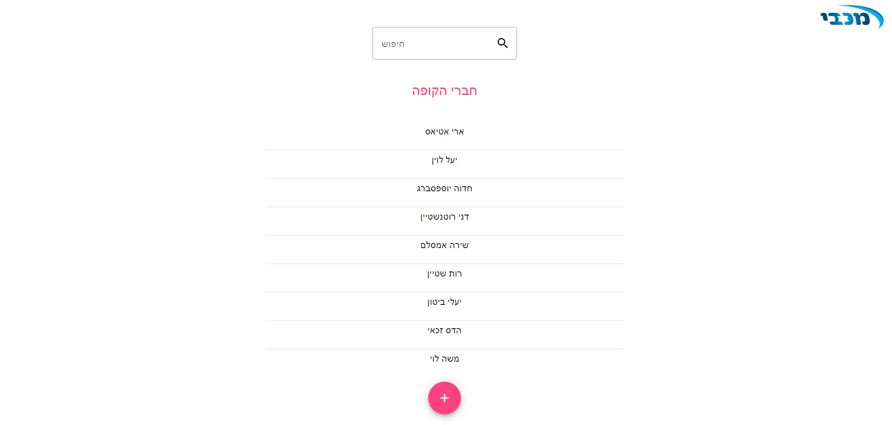
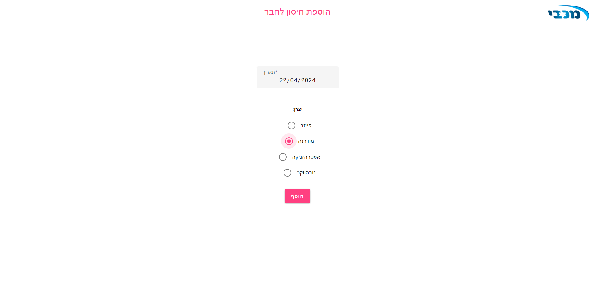

<div dir="rtl">

# פרויקט FullStack שרת-לקוח מאגר קורונה של קופת חולים 

## סקירה כללית

פרויקט זה הוא יישום מלא שפותח באמצעות C# עבור צד השרת ו Angular עבור צד הלקוח.
יישום זה משמש כמערכת מאגר נתונים לניהול חברי קופת חולים גדולה בזמן מגיפת הקורונה.
הרשומה של כל חבר כוללת פרטים אישיים: שם מלא, מספר זהות, מגורים... וכן נתוני קורונה עבור החבר: תאריך הידבקות בקורונה (אופציונלי), תאריך החלמה (אופציונלי), ורשימת החיסונים הנדרשים.


## מאפיינים

- ניהול רשומות חברי המחלקה: שליפת כל החברים, פרטים מלאים של חבר, הוספת חבר, עדכון ומחיקה.
- רשימה ועדכון תאריכי ההדבקה וההחלמה מהקורונה עבור כל חבר.
- ניהול לוחות חיסונים: הוספת החיסונים הדרושים לחבר קופה בצירוף תאריך החיסון ויצרן החיסון. לכל חבר יש לכל היותר 4 חיסונים.


## שימוש בטכנולוגיות

- **צד השרת**: C# .NET Core
- **צד הלקוח**: 17 Angular (שימוש בספריית עיצוב Angular Material)
- **מסד נתונים**: SQL Server


## התקנה

ראשית הורד את המאגר למחשב המקומי שלך. 

### התקנה בצד השרת:

1. היכנס לקובץ WebApi->WebApi.sIn ב Visual Studio והתקן את מסד הנתונים על המחשב:
פתח את package manager console (וודא שאתה נמצא על הפרויקט DataContext)
הרץ במסוף את הפקודה '<add-migration <migration-name' להוספת מיגרציה חדשה.
לאחר מכן הרץ את הפקודה 'update-database'.
כעת אתה מחובר למסד הנתונים😊
2. הרץ את הפרויקט WebApi, בזמן ההרצה ייפתח חלון הרצה בשם Swagger UI.


### התקנה בצד הלקוח:

1. היכנס לשורת הפקודה של התיקייה שנקראת project. והרץ בה את הפקודה '. code'
2. כעת הרץ בטרמינל של הפרויקט 'ng s' (שים לב שהניתוב בטרמינל נכון עבור פרויקט זה)


## אופן השימוש

מדף הבית לחיצה על הכפתור 'חברי הקופה' מביא לרשימת השמות המלאים של כל חברי הקופה. ניתן לחפש חבר מסויים על פי שם בתיבת החיפוש. <br>
נוסיף חבר קופה חדש בלחיצה על הפלוס, הוספת תמונת פרופיל לחבר-אופציונלי.<br>
לחיצה על חבר מסויים תביא אותנו לפרטים המלאים שלו, <br>
לחיצה על האייקונים בתחתית העמוד תאפשר לנו לערוך פרטי חבר, למחוק חבר או להוסיף לו חיסונים.<br>
 בכל שלב, לחיצה על הלוגו בראש הדף תנווט אל דף הבית.<br>


## צילומי מסך

<br><hr><br>

<br><hr><br>

<br><hr><br>

<br><hr><br>

<br><hr><br>

<br><hr><br>


## תלויות חיצוניות

כפי שצויין, פרויקט צד הלקוח תלוי בספרייה Angular Material. יש להתקין את הספרייה על ידי הפקודה:
```bash
ng add @angular/material
 או לחילופין, להתקין בקלות כל התקנה שהיא בפרויקט על ידי:
```bash
npm install


## הנחות

- נניח שכל חבר יכול לחלות לכל היותר פעם אחת בקורונה.


</div> 
