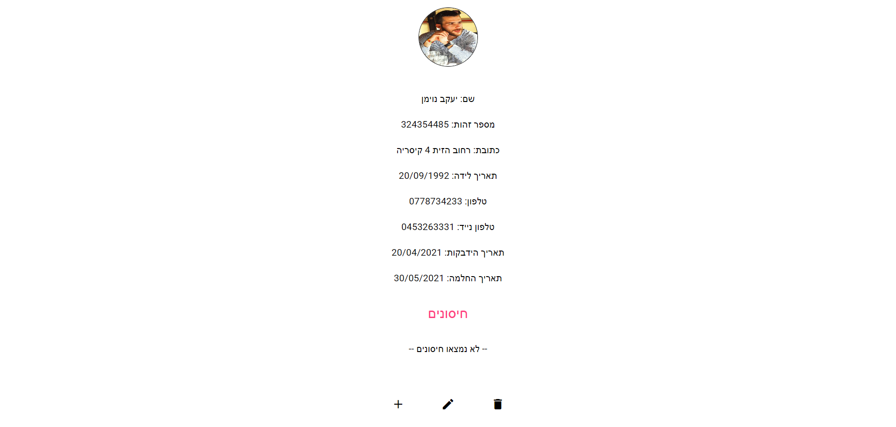

# פרויקט FullStack שרת-לקוח מאגר קורונה של קופת חולים

## סקירה כללית

פרויקט זה הוא יישום מלא בפותח באמצעות C# עבור צד השרת ו Angular עבור צד הלקוח.
יישום זה משמש כמערכת מאגר נתונים לניהול חברי קופת חולים גדולה בזמן מגיפת הקורונה.
הרשומה של כל חבר כוללת פרטים אישיים: שם מלא, מספר זהות, מגורים... וכן נתוני קורונה: תאריך הידבקות בקורונה, תאריך החלמה (אופציונליים), ורשימת החיסונים הנדרשים.

## מאפיינים

- ניהול רשומות חברי המחלקה: שליפת כל החברים, פרטים מלאים של חבר, הוספת חבר, עדכון ומחיקה.
- רשימה ועדכון תאריכי ההדבקה וההחלמה מהקורונה עבור כל חבר.
- ניהול לוחות חיסונים: הוספת חיסונים דרושים לחבר קופה בצירוף תאריך החיסון והיצרן שלו. לכל חבר יש לכל היותר 4 חיסונים.

## שימוש בטכנולוגיות

- **צד השרת**: C# .NET Core
- **צד הלקוח**: Angular (שימוש בספריית עיצוב Angular MUI)
- **מסד נתונים**: SQL Server

## התקנה

ראשית הורד את המאגר למחשב המקומי שלך. 

### התקנה בצד השרת:

1. פתח את הקובץ WebApi->WebApi.sIn ב Visual Studio והתקן דרכה את מסד הנתונים על המחשב:
פתח את package manager console (וודא שאתה נמצא על הפרויקט DataContext)
הרץ במסוף את הפקודה 'add-migration <migration-name>' להוספת מיגרציה חדשה.
לאחר מכן הרץ את הפקודה 'update-database'.
כעת אתה מחובר למסד הנתונים.
2. הרץ את הפרויקט WebApi, בזמן ההרצה ייפתח חלון הרצה בשם Swagger UI.

### התקנה בצד הלקוח:

1. היכנס לשורת הפקודה של התיקייה שנקראת project. והרץ בה את הפקודה 'code .'
2. כעת הרץ בטרמינל של הפרויקט 'ng s' (שים לב שהניתוב בטרמינל נכון עבור פרויקט זה)

## אופן השימוש

מדף הבית לחיצה על הכפתור 'חברי הקופה' מביא לרשימת השמות המלאים של כל חברי הקופה. ניתן לחפש חבר מסויים על פי שם בתיבת החיפוש.
נוסיף חבר קופה חדש בלחיצה על הכפתור 'הוסף חבר'.
לחיצה על חבר מסויים תביא אותנו לפרטים המלאים שלו, על ידי לחיצה על האייקונים בתחתית העמוד נוכל לערוך פרטי חבר, למחוק חבר או להוסיף לו חיסונים.
בכל שלב, לחיצה על הלוגו בראש הדף תנווט אל דף הבית.

## צילומי מסך

## תלויות חיצוניות

כפי שצויין, פרויקט צד הלקוח תלוי בספרייה Angular MUI. יש להתקין את הספרייה על ידי הפקודה 'ng add @angular/material'

## הנחות

-נניח שכל חבר יכול לחלות לכל היותר פעם אחת בקורונה.

 
